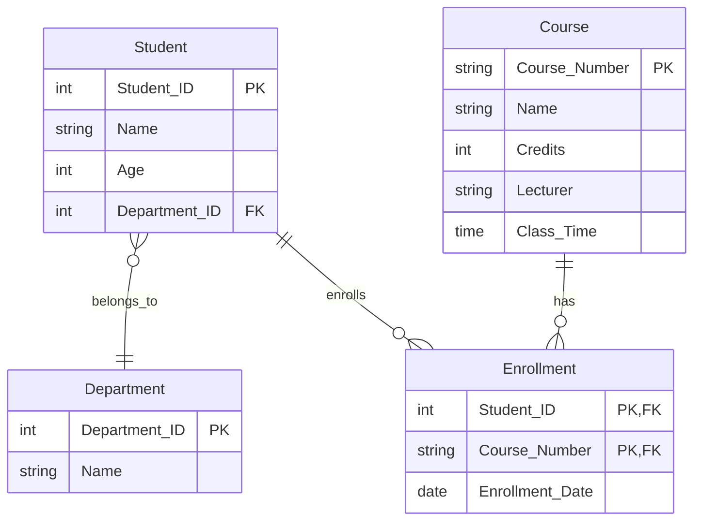

# KilluaDB - Automated Relational Database Schema Design System

A multi-agent AI system for automated relational database schema design, from natural language requirements to executable DDL statements. Now with **Domain-Aware RAG** for healthcare and other domain-compliant database design.

## 📚 Table of Contents

1. [Overview](#overview)
2. [New: Domain-Aware RAG Integration](#domain-aware-rag-integration)
3. [Project Structure](#project-structure)
4. [Installation](#installation)
5. [Quick Start](#quick-start)
6. [Inference Pipeline](#inference-pipeline)
   - [Input Requirements](#input-requirements)
   - [Processing Flow](#processing-flow)
   - [Output Artifacts](#output-artifacts)
7. [Evaluation System](#evaluation-system)
   - [Evaluation Metrics](#evaluation-metrics)
   - [Running Evaluations](#running-evaluations)
8. [API Reference](#api-reference)
9. [Configuration](#configuration)
10. [Multi-Agent Orchestration](#multi-agent-orchestration)
    - [Conversation Flow Architecture](#conversation-flow-architecture)
    - [Agent Workflow Sequence](#agent-workflow-sequence)
    - [Selector Function Logic](#selector-function-logic)
    - [Agent Communication Patterns](#agent-communication-patterns)
    - [Feedback Loops (Error Handling)](#feedback-loops-error-handling)
    - [Termination Conditions](#termination-conditions)
    - [Context Management](#context-management)
11. [Architecture Details](#architecture-details)

---

## Overview

KilluaDB is an automated database design system that uses multi-agent AI to transform natural language business requirements into fully functional relational database schemas. The system supports:

- **Conceptual Design**: Entity-Relationship (ER) modeling
- **Logical Design**: Relational schema with normalization (up to 3NF)
- **Physical Design**: PostgreSQL DDL generation with data type inference
- **Visualization**: Mermaid ER diagram generation
- **Evaluation**: Automated schema quality assessment
- **🆕 Domain-Aware RAG**: Ground-truth knowledge for domain-specific schema generation

---

## Domain-Aware RAG Integration

The system includes a **Retrieval-Augmented Generation (RAG)** module with domain-specific ground-truth knowledge for optimal database design.

### Supported Domains

| Domain | Status | Knowledge Type |
|--------|--------|----------------|
| **Healthcare** | ✅ Available | Entity definitions, relationship patterns, constraints |
| **E-Commerce** | ✅ Available | Product catalog, orders, inventory, payments |
| Finance | 🔜 Coming Soon | Financial data patterns |
| Education | 🔜 Coming Soon | Educational data models |

### Features

- **Entity Definitions**: Pre-built knowledge of common entities (Patient, Product, Order, etc.)
- **Semantic Search**: Retrieves relevant context for schema design decisions
- **Data Type Mapping**: Automatic mapping of attributes to PostgreSQL types (200+ mappings)
- **Cardinality Rules**: Cardinality patterns (0..1, 1..1, 0..*, 1..*) to SQL constraints
- **Normalization Guidance**: Domain-specific normalization recommendations with examples
- **Design Patterns**: Temporal data, audit trails, status tracking, inventory, and more
- **Constraint Rules**: CHECK constraints for data validation

### Healthcare Database Design

```python
# Use the domain-aware agent system
import asyncio
from physical_design.agent_chat_physical import main
import argparse

args = argparse.Namespace(
    model_name='gpt4',
    database_name='healthcare_db',
    requirement_text='''
    Design a patient management system that needs to:
    - Track patient demographics (name, DOB, gender, contact info)
    - Record patient encounters/visits
    - Store diagnoses with clinical status
    - Manage medication prescriptions
    '''
)

result = asyncio.run(main(args))
```

### E-Commerce Database Design

```python
# E-commerce system example
args = argparse.Namespace(
    model_name='gpt4',
    database_name='ecommerce_db',
    requirement_text='''
    Design an e-commerce platform that needs to:
    - Manage product catalog with categories and variants
    - Handle customer accounts and addresses
    - Process orders with multiple items
    - Track inventory across warehouses
    - Support coupons and discounts
    '''
)

result = asyncio.run(main(args))
```

### RAG Tools Available to Agents

| Tool | Purpose | Used By |
|------|---------|---------|
| `query_domain_rag` | General domain context retrieval | All agents |
| `get_entity_guidance` | Entity structure guidance | Conceptual Designer |
| `get_relationship_guidance` | Relationship patterns | Conceptual Designer, Reviewer |
| `get_datatype_mapping` | PostgreSQL type mapping | Physical Designer |
| `get_cardinality_rules` | Constraint generation | Logical Designer |
| `get_normalization_rules` | Normalization decisions | Logical Designer |

---

## Project Structure

```
Graduation_Project/
├── api/                          # FastAPI REST API
│   └── app.py                    # API endpoints
├── evaluation/                   # Evaluation and inference modules
│   ├── agent_format.py           # Multi-agent workflow orchestration
│   ├── api_utils.py              # LLM API interaction utilities
│   ├── data_utils.py             # Dataset loading utilities
│   ├── evaluate.py               # Schema evaluation metrics
│   ├── evaluate_sum.py           # Evaluation result aggregation
│   ├── prepared_data.py          # Data preparation scripts
│   ├── prompt_generator_format.py # Prompt templates for agents
│   ├── run.py                    # Main inference runner
│   └── utils.py                  # General utilities
├── physical_design/              # Physical design module
│   ├── agent_chat_physical.py    # AutoGen multi-agent implementation
│   ├── llm_tools.py              # LLM utility functions
│   ├── mermaid_tools.py          # Mermaid diagram generation
│   ├── postgres_tools.py         # PostgreSQL DDL tools
│   ├── tools.py                  # Shared tool functions
│   └── user_prompt_english.py    # Agent prompt definitions
├── rag/                          # 🆕 Domain-Aware RAG module
│   ├── __init__.py               # Module exports
│   ├── base_rag.py               # Abstract base retriever
│   ├── rag_config.py             # Domain detection & configuration
│   ├── rag_tools.py              # Agent tool functions
│   ├── README.md                 # RAG documentation
│   └── domains/
│       └── healthcare/           # Healthcare ground-truth knowledge
│           ├── healthcare_config.py    # Type mappings, lookups
│           └── healthcare_retriever.py # Healthcare RAG retriever
├── shared/                       # Shared utilities
│   └── normalization_utils.py    # Database normalization algorithms
├── datasets/                     # Evaluation datasets
│   └── RSchema/                  # Relational schema annotations
├── outputs/                      # Generated outputs
├── llm_config.py                 # Centralized LLM configuration
├── requirements.txt              # Python dependencies
├── Dockerfile                    # Docker container definition
└── docker-compose.yml            # Docker compose configuration
```

## Installation

### Prerequisites

- Python 3.10+
- PostgreSQL (optional, for physical design execution)
- Node.js (optional, for Mermaid CLI rendering)

### Install Dependencies

```bash
# Create virtual environment (recommended)
python -m venv venv
source venv/bin/activate  # On Windows: venv\Scripts\activate

# Install requirements
pip install -r requirements.txt

# Download spaCy model for text processing
python -m spacy download en_core_web_sm
```

### Environment Variables

Create a `.env` file in the project root:

```env
# LLM API Keys (at least one required)
OPENAI_API_KEY=your_openai_key
ANTHROPIC_API_KEY=your_anthropic_key
GEMINI_API_KEY=your_gemini_key
HUGGINGFACE_API_KEY=your_huggingface_key

# RAG Configuration (optional)
HEALTHCARE_VERSION=4.0.1  # Healthcare standard version
EMBEDDING_MODEL=sentence-transformers/all-MiniLM-L6-v2
RAG_TOP_K=5

# PostgreSQL Configuration (optional)
POSTGRES_HOST=localhost
POSTGRES_PORT=5432
POSTGRES_USER=postgres
POSTGRES_PASSWORD=postgres
POSTGRES_DATABASE=schema_agent
```

## Quick Start

### Using the API

```bash
# Start the API server
cd api
uvicorn app:app --reload --host 0.0.0.0 --port 8000

# Generate schema from requirements
curl -X POST "http://localhost:8000/schema/generate" \
  -H "Content-Type: application/json" \
  -d '{
    "requirement_text": "A university needs a student course selection management system...",
    "model_name": "gpt4",
    "database_name": "university_db"
  }'
```

### Using Python Directly

```python
import asyncio
from physical_design.agent_chat_physical import main
import argparse

args = argparse.Namespace(
    model_name='gpt4',
    database_name='my_database',
    requirement_text='A library management system that tracks books, members, and loans...'
)

result = asyncio.run(main(args))
print(result)
```

---

## Inference Pipeline

### Input Requirements

The system accepts natural language business requirements in English. A good requirement should include:

1. **Entities**: Objects/things to be stored (e.g., "Students", "Courses")
2. **Attributes**: Properties of entities (e.g., "student ID", "name", "age")
3. **Relationships**: How entities relate (e.g., "students enroll in courses")
4. **Constraints**: Business rules (e.g., "each student can enroll in multiple courses")

**Example Input:**
```text
A university needs a student course selection management system to maintain 
and track students' course selection information. Students have information 
such as student ID, name, age, department. Each student can take multiple 
courses. Each course has information such as course number, course name, 
credits, lecturer and class time.
```

### Processing Flow

The inference pipeline follows a multi-phase design process:

```
┌─────────────────────────────────────────────────────────────────────────┐
│                        INFERENCE PIPELINE                                │
└─────────────────────────────────────────────────────────────────────────┘

INPUT: Natural Language Requirements
            │
            ▼
┌───────────────────────────────────────┐
│  PHASE 1: REQUIREMENT ANALYSIS        │
│  ┌─────────────────────────────────┐  │
│  │ ManagerAgent                    │  │
│  │ - Analyzes user requirements    │  │
│  │ - Clarifies ambiguities         │  │
│  │ - Coordinates design process    │  │
│  │ - Produces requirement report   │  │
│  └─────────────────────────────────┘  │
└───────────────────────────────────────┘
            │
            ▼
┌───────────────────────────────────────┐
│  PHASE 2: CONCEPTUAL DESIGN           │
│  ┌─────────────────────────────────┐  │
│  │ ConceptualDesignerAgent         │  │
│  │ - Identifies entity sets        │  │
│  │ - Defines attributes            │  │
│  │ - Identifies relationships      │  │
│  │ - Determines cardinality        │  │
│  └─────────────────────────────────┘  │
│            │                          │
│            ▼                          │
│  ┌─────────────────────────────────┐  │
│  │ ConceptualReviewerAgent         │  │
│  │ - Validates conceptual model    │  │
│  │ - Checks for missing entities   │  │
│  │ - Approves or requests changes  │  │
│  └─────────────────────────────────┘  │
└───────────────────────────────────────┘
            │
            ▼
┌───────────────────────────────────────┐
│  PHASE 3: LOGICAL DESIGN              │
│  ┌─────────────────────────────────┐  │
│  │ LogicalDesignerAgent            │  │
│  │ Tools:                          │  │
│  │ - get_attribute_keys_by_armstrong│ │
│  │   (Primary key discovery)       │  │
│  │ - confirm_to_third_normal_form  │  │
│  │   (3NF decomposition)           │  │
│  └─────────────────────────────────┘  │
│            │                          │
│  Steps performed:                     │
│  1. Convert entities to relations     │
│  2. Identify functional dependencies  │
│  3. Apply Armstrong's axioms          │
│  4. Discover candidate keys           │
│  5. Decompose to 3NF if needed        │
│  6. Add foreign key constraints       │
└───────────────────────────────────────┘
            │
            ▼
┌───────────────────────────────────────┐
│  PHASE 4: TEST & VALIDATION           │
│  ┌─────────────────────────────────┐  │
│  │ TestAgent                       │  │
│  │ - Generates test cases          │  │
│  │ - Creates validation queries    │  │
│  │ - Evaluates schema against tests│  │
│  │ - Checks constraint satisfaction│  │
│  │ - Performs intuitive checks     │  │
│  └─────────────────────────────────┘  │
│            │                          │
│  Feedback Loops:                      │
│  ┌─────────────────────────────────┐  │
│  │ On failure:                     │  │
│  │ → Conceptual issues: Route to   │  │
│  │   ConceptualDesignerAgent       │  │
│  │ → Logical issues: Route to      │  │
│  │   LogicalDesignerAgent          │  │
│  └─────────────────────────────────┘  │
└───────────────────────────────────────┘
            │
            ▼
┌───────────────────────────────────────┐
│  PHASE 5: PHYSICAL DESIGN             │
│  ┌─────────────────────────────────┐  │
│  │ PhysicalDesignerAgent           │  │
│  │ Tools:                          │  │
│  │ - infer_and_generate_ddl        │  │
│  │ - validate_ddl_syntax           │  │
│  │ - execute_ddl_statements        │  │
│  │ - test_postgres_connection      │  │
│  └─────────────────────────────────┘  │
│            │                          │
│  Features:                            │
│  - Data type inference from names     │
│  - Index recommendations              │
│  - Self-refinement on errors          │
│            │                          │
│  Input: Logical Schema from Phase 3   │
└───────────────────────────────────────┘
            │
            ▼
┌───────────────────────────────────────┐
│  PHASE 6: REPORTING                   │
│  ┌─────────────────────────────────┐  │
│  │ ReportAgent                     │  │
│  │ - Compiles final report         │  │
│  │ - Includes Mermaid ER diagram   │  │
│  │ - Documents design decisions    │  │
│  └─────────────────────────────────┘  │
└───────────────────────────────────────┘
            │
            ▼
OUTPUT: Logical Schema (JSON) + DDL + Mermaid Diagram + Report
```

### Output Artifacts

The system generates multiple output artifacts:

#### 1. Logical Schema (JSON)

```json
{
  "Student": {
    "Attributes": ["Student_ID", "Name", "Age", "Department_ID"],
    "Primary key": ["Student_ID"],
    "Foreign key": {
      "Department_ID": {"Department": "Department_ID"}
    }
  },
  "Course": {
    "Attributes": ["Course_Number", "Name", "Credits", "Lecturer", "Class_Time"],
    "Primary key": ["Course_Number"]
  },
  "Enrollment": {
    "Attributes": ["Student_ID", "Course_Number", "Enrollment_Date"],
    "Primary key": ["Student_ID", "Course_Number"],
    "Foreign key": {
      "Student_ID": {"Student": "Student_ID"},
      "Course_Number": {"Course": "Course_Number"}
    }
  }
}
```

#### 2. DDL Statements (PostgreSQL)

```sql
CREATE TABLE Department (
    Department_ID SERIAL PRIMARY KEY,
    Name VARCHAR(255) NOT NULL
);

CREATE TABLE Student (
    Student_ID SERIAL PRIMARY KEY,
    Name VARCHAR(255) NOT NULL,
    Age INTEGER,
    Department_ID INTEGER REFERENCES Department(Department_ID)
);

CREATE TABLE Course (
    Course_Number VARCHAR(50) PRIMARY KEY,
    Name VARCHAR(255) NOT NULL,
    Credits SMALLINT,
    Lecturer VARCHAR(255),
    Class_Time TIME
);

CREATE TABLE Enrollment (
    Student_ID INTEGER REFERENCES Student(Student_ID),
    Course_Number VARCHAR(50) REFERENCES Course(Course_Number),
    Enrollment_Date DATE DEFAULT CURRENT_DATE,
    PRIMARY KEY (Student_ID, Course_Number)
);

-- Recommended indexes
CREATE INDEX idx_student_department ON Student(Department_ID);
CREATE INDEX idx_enrollment_student ON Enrollment(Student_ID);
CREATE INDEX idx_enrollment_course ON Enrollment(Course_Number);
```

#### 3. Mermaid ER Diagram



---

## Evaluation System

The evaluation system assesses the quality of generated schemas by comparing them against human-annotated ground truth.

### Evaluation Metrics

| Metric | Description | Formula |
|--------|-------------|---------|
| **Schema F1** | Table/relation matching accuracy | 2×P×R / (P+R) |
| **Schema AllCorrect** | 1 if all tables match, else 0 | Binary |
| **Attribute F1** | Attribute matching accuracy per table | Average across tables |
| **Attribute AllCorrect** | 1 if all attributes match per table | Average across tables |
| **Primary Key Accuracy** | Primary key identification correctness | Proportion correct |
| **Foreign Key Accuracy** | Foreign key identification correctness | Proportion correct |
| **Schema AllCorrect Full** | Complete schema match (all metrics) | Binary |

### Schema/Attribute Matching

Matching between predicted and ground truth uses multiple strategies:

1. **Synonym Matching**: Uses WordNet to find synonyms (e.g., "Student" ≈ "Pupil")
2. **Semantic Similarity**: Uses sentence-transformers for embedding similarity
3. **String Overlap**: N-gram and substring matching for partial matches

### Running Evaluations

#### Evaluate a Single Model Output

```python
from evaluation.evaluate import evaluate, get_jsonl

# Load ground truth and predictions
golden = get_jsonl('datasets/RSchema/annotation.jsonl')
predictions = get_jsonl('outputs/DBdesign/model_output.jsonl')

# Evaluate each sample
for sample_id in predictions:
    if sample_id in golden:
        golden_schema = golden[sample_id]['answer']
        predicted_schema = predictions[sample_id]['predict']
        
        scores = evaluate(golden_schema, predicted_schema)
        print(f"Sample {sample_id}: {scores}")
```

#### Run Full Evaluation Pipeline

```bash
cd evaluation

# Run evaluation on a dataset
python run.py \
  --model_name gpt4 \
  --method base_direct \
  --dataset_dir ./datasets/RSchema/ \
  --output_files_folder ./outputs/DBdesign

# Aggregate evaluation results
python evaluate_sum.py
```

### Evaluation Output

```json
{
  "id": "sample_001",
  "score": {
    "schema mapping": {"Student": "Student", "Course": "Course"},
    "attribute mapping": {"Student": {"ID": "Student_ID", "Name": "Name"}},
    "schema f1": 1.0,
    "schema allcorrect": 1,
    "attribute f1 avg": 0.95,
    "attribute allcorrect avg": 0.67,
    "primary key avg": 1.0,
    "foreign key avg": 0.5,
    "schema allcorrect full": 0
  }
}
```

---

## API Reference

### Endpoints

| Method | Endpoint | Description |
|--------|----------|-------------|
| GET | `/` | API information |
| GET | `/health` | Health check |
| POST | `/schema/generate` | Generate schema from requirements |
| POST | `/mermaid/validate` | Validate Mermaid diagram syntax |
| GET | `/postgres/test` | Test PostgreSQL connection |
| POST | `/postgres/execute` | Execute DDL statements |

### Generate Schema

**Request:**
```json
{
  "requirement_text": "Business requirements description...",
  "model_name": "gpt4",
  "database_name": "my_database"
}
```

**Response:**
```json
{
  "success": true,
  "message": "Schema generated successfully",
  "mmd": "erDiagram\n    Student {...}",
  "mmd_valid": true,
  "db_schema": {...},
  "ddl": "CREATE TABLE Student ...",
  "full_report": "# Database Design Report\n...",
  "generation_time": 45.2
}
```

---

## Configuration

### Supported LLM Models

Configured in `llm_config.py`:

| Model Key | Provider | Model Name |
|-----------|----------|------------|
| `gpt4` | OpenAI | gpt-4o-2024-08-06 |
| `gpt4.5` | OpenAI | gpt-4.5-preview |
| `claude4` | Anthropic | claude-sonnet-4-20250514 |
| `gemini-2.5-pro` | Google | gemini-2.5-pro-preview |
| `deepseek` | HuggingFace | deepseek-ai/DeepSeek-V3 |

### Adding New Models

```python
# In llm_config.py
MODEL_PROVIDERS = {
    'my_model': {
        'provider': 'openai',  # or 'anthropic', 'google', 'huggingface'
        'model_name': 'model-name-from-provider',
        'base_url': 'https://api.provider.com/v1/',
        'api_key_env': 'MY_API_KEY',
    },
}
```

---

## Multi-Agent Orchestration

### Conversation Flow Architecture

The system uses a **SelectorGroupChat** with a custom `selector_func` to orchestrate agent conversations. This ensures the workflow follows a logical sequence while allowing for dynamic routing when errors occur.

**Agents in the Pipeline:**
| Agent | Role | Phase |
|-------|------|-------|
| **ManagerAgent** | Analyzes requirements, coordinates workflow, final acceptance | 1, 6 |
| **ConceptualDesignerAgent** | Creates ER model with entities, attributes, relationships | 2 |
| **ConceptualReviewerAgent** | Validates conceptual model, approves or requests revisions | 2 |
| **LogicalDesignerAgent** | Converts to relational schema, normalizes to 3NF | 3 |
| **TestAgent** | Generates and executes test cases, validates schema | 4 |
| **PhysicalDesignerAgent** | Generates PostgreSQL DDL, infers data types, creates indexes | 5 |
| **PhysicalReviewerAgent** | Validates DDL syntax, data types, constraints | 5 |
| **ReportAgent** | Compiles final report with Mermaid diagrams | 6 |

### Agent Workflow Sequence

```
┌─────────────────────────────────────────────────────────────────────────────┐
│                     MULTI-AGENT ORCHESTRATION FLOW                          │
└─────────────────────────────────────────────────────────────────────────────┘

                              ┌──────────────┐
                              │    User      │
                              │  (Input)     │
                              └──────┬───────┘
                                     │ Natural Language Requirements
                                     ▼
┌────────────────────────────────────────────────────────────────────────────┐
│  STEP 1: REQUIREMENT ANALYSIS                                               │
│  ┌────────────────────────────────────────────────────────────────────────┐│
│  │ ManagerAgent                                                           ││
│  │ • Analyzes user requirements                                           ││
│  │ • Clarifies ambiguities with real-world scenarios                      ││
│  │ • Produces structured requirement analysis report                       ││
│  │ • Output: { "requirement analysis results": "..." }                    ││
│  └────────────────────────────────────────────────────────────────────────┘│
└────────────────────────────────────────────────────────────────────────────┘
                                     │
                                     ▼
┌────────────────────────────────────────────────────────────────────────────┐
│  STEP 2: CONCEPTUAL DESIGN                                                  │
│  ┌────────────────────────────────────────────────────────────────────────┐│
│  │ ConceptualDesignerAgent                                                ││
│  │ • Identifies entities from requirements                                ││
│  │ • Defines attributes for each entity                                   ││
│  │ • Maps relationships between entities                                  ││
│  │ • Determines cardinality (1:1, 1:N, M:N)                               ││
│  │ • Uses RAG for domain-specific guidance                                ││
│  └────────────────────────────────────────────────────────────────────────┘│
│                                     │                                       │
│                                     ▼                                       │
│  ┌────────────────────────────────────────────────────────────────────────┐│
│  │ ConceptualReviewerAgent                                                ││
│  │ • Validates conceptual model                                           ││
│  │ • Checks constraints and completeness                                  ││
│  │ • Approves or requests revisions                                       ││
│  │ • Uses RAG for validation rules                                        ││
│  └────────────────────────────────────────────────────────────────────────┘│
│                                     │                                       │
│                          ┌──────────┴──────────┐                            │
│                          ▼                     ▼                            │
│                    ┌──────────┐          ┌──────────┐                       │
│                    │ Approve  │          │ Revise   │                       │
│                    └────┬─────┘          └────┬─────┘                       │
│                         │                     │                             │
│                         │                     └──→ ConceptualDesignerAgent  │
│                         ▼                                                   │
│  • Output: Conceptual model in JSON format                                  │
└────────────────────────────────────────────────────────────────────────────┘
                                     │
                                     ▼
┌────────────────────────────────────────────────────────────────────────────┐
│  STEP 3: LOGICAL DESIGN                                                     │
│  ┌────────────────────────────────────────────────────────────────────────┐│
│  │ LogicalDesignerAgent                                                   ││
│  │ • Converts ER model to relational schema                               ││
│  │ • Identifies functional dependencies                                   ││
│  │ • Tools: get_attribute_keys_by_armstrong, confirm_to_third_normal_form ││
│  │ • Discovers candidate/primary keys                                     ││
│  │ • Decomposes to 3NF if necessary                                       ││
│  │ • Adds foreign key constraints                                         ││
│  │ • Uses RAG for normalization guidance                                  ││
│  └────────────────────────────────────────────────────────────────────────┘│
└────────────────────────────────────────────────────────────────────────────┘
                                     │
                                     ▼
┌────────────────────────────────────────────────────────────────────────────┐
│  STEP 4: TEST & VALIDATION                                                  │
│  ┌────────────────────────────────────────────────────────────────────────┐│
│  │ TestAgent                                                              ││
│  │ • Generates test cases from requirements                               ││
│  │ • Creates validation scenarios                                         ││
│  │ • Evaluates schema against test cases                                  ││
│  │ • Performs intuitive checks                                            ││
│  │ • Context: Can only see ManagerAgent's requirement analysis            ││
│  │ • Ensures tests cover functional requirements                          ││
│  └────────────────────────────────────────────────────────────────────────┘│
│                                     │                                       │
│  ┌──────────────────────────────────┴───────────────────────────────────┐  │
│  │                     FEEDBACK LOOPS                                    │  │
│  │                                                                       │  │
│  │   ┌─────────────┐     ┌─────────────────────┐     ┌───────────────┐  │  │
│  │   │   APPROVE   │     │  REJECT (Conceptual)│     │REJECT (Logical)│ │  │
│  │   │      │      │     │         │           │     │       │       │  │  │
│  │   │      ▼      │     │         ▼           │     │       ▼       │  │  │
│  │   │  Manager    │     │   Conceptual        │     │   Logical     │  │  │
│  │   │   Agent     │     │   DesignerAgent     │     │   Designer    │  │  │
│  │   │(Acceptance) │     │         │           │     │   Agent       │  │  │
│  │   └─────────────┘     │         ▼           │     │       │       │  │  │
│  │                       │   Logical Designer  │     │       ▼       │  │  │
│  │                       │         │           │     │   TestAgent   │  │  │
│  │                       │         ▼           │     │   (Re-test)   │  │  │
│  │                       │     TestAgent       │     └───────────────┘  │  │
│  │                       │     (Re-test)       │                        │  │
│  │                       └─────────────────────┘                        │  │
│  └──────────────────────────────────────────────────────────────────────┘  │
└────────────────────────────────────────────────────────────────────────────┘
                                     │
                                     │ (On Approval)
                                     ▼
┌────────────────────────────────────────────────────────────────────────────┐
│  STEP 5: PHYSICAL DESIGN                                                    │
│  ┌────────────────────────────────────────────────────────────────────────┐│
│  │ PhysicalDesignerAgent                                                  ││
│  │ • Converts logical schema to PostgreSQL DDL                            ││
│  │ • Infers appropriate data types from attribute names                   ││
│  │ • Tools: infer_and_generate_ddl, validate_ddl_syntax                   ││
│  │ • Generates CREATE TABLE statements with constraints                   ││
│  │ • Adds indexes for foreign keys and frequently queried columns         ││
│  │ • Uses RAG for domain-specific type mappings                           ││
│  └────────────────────────────────────────────────────────────────────────┘│
│                                     │                                       │
│                                     ▼                                       │
│  ┌────────────────────────────────────────────────────────────────────────┐│
│  │ PhysicalReviewerAgent                                                  ││
│  │ • Validates DDL syntax and structure                                   ││
│  │ • Checks data type appropriateness                                     ││
│  │ • Verifies constraint definitions                                      ││
│  │ • Approves or requests revisions                                       ││
│  └────────────────────────────────────────────────────────────────────────┘│
│                                     │                                       │
│                          ┌──────────┴──────────┐                            │
│                          ▼                     ▼                            │
│                    ┌──────────┐          ┌──────────┐                       │
│                    │ Approve  │          │ Revise   │                       │
│                    └────┬─────┘          └────┬─────┘                       │
│                         │                     │                             │
│                         │          ┌──────────┴──────────┐                  │
│                         │          ▼                     ▼                  │
│                         │    ┌───────────┐        ┌───────────┐             │
│                         │    │  Physical │        │  Logical  │             │
│                         │    │  Designer │        │  Designer │             │
│                         │    │  (Refine) │        │  (Schema  │             │
│                         │    └───────────┘        │   Issue)  │             │
│                         │                         └───────────┘             │
│                         ▼                                                   │
│  • Output: PostgreSQL DDL statements                                        │
└────────────────────────────────────────────────────────────────────────────┘
                                     │
                                     ▼
┌────────────────────────────────────────────────────────────────────────────┐
│  STEP 6: FINAL ACCEPTANCE                                                   │
│  ┌────────────────────────────────────────────────────────────────────────┐│
│  │ ManagerAgent                                                           ││
│  │ • Performs final acceptance check                                      ││
│  │ • Verifies schema meets all requirements                               ││
│  │ • Decision:                                                            ││
│  │   - Accept → Output "TERMINATE" and final schema                       ││
│  │   - Challenge → Request TestAgent to retest                            ││
│  └────────────────────────────────────────────────────────────────────────┘│
└────────────────────────────────────────────────────────────────────────────┘
                                     │
                                     ▼
                           ┌─────────────────┐
                           │   TERMINATE     │
                           │  Final Schema   │
                           │    Output       │
                           └─────────────────┘
```

### Selector Function Logic

The `selector_func` in `user_prompt_english.py` implements the following routing logic:

```python
def selector_func(messages) -> str | None:
    """
    Routes conversation to the next appropriate agent.
    
    Rules:
    1. User → ManagerAgent (start workflow)
    2. ManagerAgent → ConceptualDesignerAgent (conceptual design)
    3. ConceptualDesignerAgent → ConceptualReviewerAgent (review)
    4. ConceptualReviewerAgent → LogicalDesignerAgent (on approval)
    5. ConceptualReviewerAgent → ConceptualDesignerAgent (on revision)
    6. LogicalDesignerAgent → TestAgent (test & validation)
    7. TestAgent → PhysicalDesignerAgent (on approval)
    8. TestAgent → ConceptualDesignerAgent/LogicalDesignerAgent (on failure)
    9. PhysicalDesignerAgent → PhysicalReviewerAgent (DDL review)
    10. PhysicalReviewerAgent → ManagerAgent (on approval)
    11. PhysicalReviewerAgent → PhysicalDesignerAgent (DDL refinement)
    12. PhysicalReviewerAgent → LogicalDesignerAgent (schema issue)
    
    If an agent explicitly mentions another agent name in their response,
    that agent is selected next (enables error routing).
    """
```

### Agent Communication Patterns

| Source Agent | Next Agent | Trigger Condition |
|--------------|------------|-------------------|
| User | ManagerAgent | Always (starts workflow) |
| ManagerAgent | ConceptualDesignerAgent | After requirement analysis |
| ConceptualDesignerAgent | ConceptualReviewerAgent | After conceptual model created |
| ConceptualReviewerAgent | LogicalDesignerAgent | After conceptual model approved |
| ConceptualReviewerAgent | ConceptualDesignerAgent | Conceptual model needs revision |
| LogicalDesignerAgent | TestAgent | After logical schema complete |
| TestAgent | PhysicalDesignerAgent | Tests passed (approval) |
| TestAgent | ConceptualDesignerAgent | Tests failed (conceptual issues) |
| TestAgent | LogicalDesignerAgent | Tests failed (logical issues) |
| PhysicalDesignerAgent | PhysicalReviewerAgent | After DDL generated |
| PhysicalReviewerAgent | ManagerAgent | After DDL approved |
| PhysicalReviewerAgent | PhysicalDesignerAgent | DDL needs refinement |
| PhysicalReviewerAgent | LogicalDesignerAgent | Schema issue detected |
| ManagerAgent | TestAgent | Challenge results, request retest |
| ManagerAgent | (TERMINATE) | Final acceptance complete |

### Feedback Loops (Error Handling)

The system has **two feedback loops** for iterative refinement:

#### Loop 1: Conceptual Design Loop

```
┌──────────────────────────────────────────────────────────────┐
│  CONCEPTUAL DESIGN LOOP (RoundRobinGroupChat)                │
│                                                              │
│   ConceptualDesignerAgent ←──────→ ConceptualReviewerAgent   │
│         │                                │                   │
│         │ Creates/Revises               │ Validates          │
│         │ Conceptual Model              │ Against Rules      │
│         │                                │                   │
│         └────────────────────────────────┘                   │
│                        │                                     │
│                        ▼                                     │
│              ┌─────────────────────┐                         │
│              │ Approve → Logical   │                         │
│              │ Revise → Designer   │                         │
│              └─────────────────────┘                         │
│                                                              │
│   Termination: "Approve" mentioned OR max 15 messages        │
└──────────────────────────────────────────────────────────────┘
```

**Logic:**
- `ConceptualDesignerAgent` creates ER model
- `ConceptualReviewerAgent` validates using pseudocode rules:
  - Checks relationship attributes don't contain IDs
  - Validates proportional relationship types
  - Ensures all entities appear in relationships
- If validation fails → "send to ConceptualDesignerAgent for revision"
- If validation passes → "Approve" → Proceed to LogicalDesignerAgent
- Loop continues until "Approve" or max messages reached

#### Loop 2: Test Feedback Loop

```
┌─────────────────────────────────────────────────────────────────────────────┐
│  TEST FEEDBACK LOOP (Error Correction)                                       │
│                                                                              │
│  Normal Flow:                                                                │
│  Manager → Conceptual → Reviewer → Logical → Test → Manager → TERMINATE     │
│              Designer     Agent     Designer  Agent   Agent                  │
│                                                                              │
│  Error Flow (from TestAgent):                                                │
│                                                                              │
│  ┌─────────────────────────────────────────────────────────────────────────┐│
│  │  TestAgent detects failure:                                             ││
│  │                                                                          ││
│  │  "Reject, send to ConceptualDesignerAgent"                              ││
│  │       │                                                                  ││
│  │       └──→ ConceptualDesigner ──→ LogicalDesigner ──→ TestAgent         ││
│  │                                                                          ││
│  │  "Reject, send to LogicalDesignerAgent"                                 ││
│  │       │                                                                  ││
│  │       └──→ LogicalDesigner ──→ TestAgent                                ││
│  │                                                                          ││
│  │  After fix, workflow continues through remaining phases                  ││
│  └─────────────────────────────────────────────────────────────────────────┘│
│                                                                              │
│  Manager Challenge (from ManagerAgent):                                      │
│  "Request TestAgent to retest"                                               │
│       │                                                                      │
│       └──→ TestAgent ──→ ManagerAgent                                        │
└─────────────────────────────────────────────────────────────────────────────┘
```

**Error Detection Logic (in `selector_func`):**
```python
# TestAgent's output is analyzed for failure indicators
is_rejected = (
    'Reject' in content or 
    'fail' in content.lower() or
    'error' in content.lower() or
    'revision' in content.lower()
)

if is_rejected:
    # Route based on explicit agent mention
    if 'ConceptualDesignerAgent' in content:
        return 'ConceptualDesignerAgent'  # Restart from conceptual
    elif 'LogicalDesignerAgent' in content:
        return 'LogicalDesignerAgent'  # Fix logical only
    else:
        return 'LogicalDesignerAgent'  # Default fix point
```

**Key Points:**
- `TestAgent` decides which phase needs revision based on test results
- Explicit agent names in output trigger specific routing
- After a fix, the workflow continues through remaining phases (not restart from beginning)
- `ManagerAgent` can challenge and request retesting via `TestAgent`

#### Loop 3: Physical Design Loop

```
┌──────────────────────────────────────────────────────────────┐
│  PHYSICAL DESIGN LOOP (RoundRobinGroupChat)                  │
│                                                              │
│   PhysicalDesignerAgent ←────────→ PhysicalReviewerAgent     │
│         │                                │                   │
│         │ Generates/Refines            │ Validates DDL      │
│         │ DDL Statements               │ Syntax & Types     │
│         │                                │                   │
│         └────────────────────────────────┘                   │
│                        │                                     │
│                        ▼                                     │
│              ┌──────────────────────────────┐                │
│              │ Approve → Final Acceptance │                │
│              │ Revise DDL → Designer     │                │
│              │ Schema Issue → Logical    │                │
│              └──────────────────────────────┘                │
│                                                              │
│   Termination: "Approve" mentioned OR max 10 messages        │
└──────────────────────────────────────────────────────────────┘
```

**Logic:**
- `PhysicalDesignerAgent` generates PostgreSQL DDL from logical schema
- `PhysicalReviewerAgent` validates:
  - DDL syntax correctness
  - Data type appropriateness for attributes
  - Constraint definitions (PK, FK, NOT NULL, etc.)
  - Index recommendations
- If validation fails with DDL issues → "send to PhysicalDesignerAgent for refinement"
- If validation fails with schema issues → "send to LogicalDesignerAgent" (schema needs fixing)
- If validation passes → "Approve" → Proceed to Final Acceptance
- Loop continues until "Approve" or max messages reached

### Termination Conditions

The conversation terminates when:
1. **TextMentionTermination**: An agent outputs "TERMINATE"
2. **MaxMessageTermination**: Maximum 15 messages reached (safety limit)

### Context Management

Each agent has selective context visibility:
- **TestAgent**: Only sees ManagerAgent's requirement analysis (isolated from design details)
- **ConceptualDesignerAgent**: Sees previous messages from the design loop
- **Other agents**: Full conversation visibility

This isolation ensures:
- Test cases are generated purely from requirements (not influenced by design)
- Conceptual designers focus on their domain without noise from other phases

---

## Architecture Details

### Multi-Agent System

The system uses [AutoGen](https://github.com/microsoft/autogen) for multi-agent orchestration:

- **SelectorGroupChat**: Dynamic agent selection based on task context
- **RoundRobinGroupChat**: Sequential agent collaboration for design-review cycles

### Normalization Algorithms

Located in `shared/normalization_utils.py`:

1. **Armstrong's Axioms**: Closure computation for attribute sets
2. **Candidate Key Discovery**: Finds minimal superkeys
3. **3NF Decomposition**: Identifies partial/transitive dependencies

### Data Type Inference

The `postgres_tools.py` module infers PostgreSQL data types from attribute names:

- `*_id` → `SERIAL PRIMARY KEY` or `INTEGER`
- `*name*` → `VARCHAR(255)`
- `*date*` → `DATE`
- `*price*`, `*cost*` → `DECIMAL(10,2)`
- `*email*` → `VARCHAR(255) UNIQUE`

---

## Troubleshooting

### Common Issues

1. **API Key Not Found**
   - Ensure `.env` file exists with correct API keys
   - Check environment variable names match `*_API_KEY` pattern

2. **spaCy Model Missing**
   - Run: `python -m spacy download en_core_web_sm`

3. **PostgreSQL Connection Failed**
   - Verify PostgreSQL is running
   - Check connection parameters in `.env`

4. **Mermaid Validation Failed**
   - Install mermaid-cli: `npm install -g @mermaid-js/mermaid-cli`

---

## License

This project is developed as part of a graduation project. Please contact the maintainers for licensing information.

## Contributors

- Ali Mohamed (Primary Developer)
